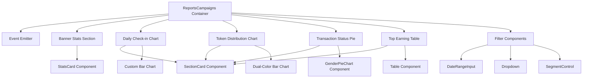

# System Design & Architecture

## Architecture Overview
**What is the high-level system structure?**



### Key Components
- **ReportsCampaigns**: Main container component managing state and layout
- **Reusable UI Components**: StatsCard, SectionCard, DateRangeInput, Dropdown, GenderPieChart
- **Custom Charts**: Bar charts for check-ins and token distribution
- **Tables**: Top earning table with multiple columns

### Technology Stack
- React 19 with TypeScript
- Tailwind 4 for styling
- Existing chart components (recharts library based on codebase patterns)

## Data Models
**What data do we need to manage?**

### Banner Performance Stats
```typescript
interface BannerStats {
  views: number;
  clicks: number;
  clickRate: string; // percentage
  pubRegistrations: number;
  cvr: string; // percentage
}
```

### Daily Check-in Data
```typescript
interface CheckinDataPoint {
  date: string;
  totalClicks: number;
  uniqueParticipants: number;
  completionRate: string;
}
```

### Token Distribution Data
```typescript
interface TokenDistribution {
  date: string;
  personal: number;
  member: number;
}

interface TokenStats {
  total: string;
  personal: string;
  member: string;
}
```

### Transaction Status
```typescript
interface TransactionStatus {
  name: string;
  value: number;
  percentage: string;
  color: string;
}
```

### Top Earning Entry
```typescript
interface TopEarner {
  rank: number;
  name: string;
  email: string;
  flag: string;
  totalIncome: string;
  personal: string;
  f1: string;
  f2: string;
  f3: string;
}
```

## Component Breakdown
**What are the major building blocks?**

### 1. Banner Performance Section
- **Component**: Custom stats row using StatsCard
- **Data**: BannerStats
- **Layout**: 4 stats cards in a row with dividers

### 2. Daily Check-in Chart Section
- **Component**: SectionCard + Custom Bar Chart
- **Data**: Array of CheckinDataPoint
- **Features**: Stats summary above chart, hover tooltips

### 3. Token Distribution Section
- **Component**: SectionCard + Dual-color Bar Chart
- **Data**: Array of TokenDistribution
- **Features**: Legend showing personal vs member, hover tooltip with breakdown

### 4. Transaction Status Section
- **Component**: SectionCard + GenderPieChart (reused)
- **Data**: Array of TransactionStatus
- **Features**: Donut chart with center label, legend on the right

### 5. Top Earning Table
- **Component**: SectionCard + Custom Table
- **Data**: Array of TopEarner
- **Features**: Sortable columns, alternating row colors, flag icons

### 6. Filter Controls
- **Components**: DateRangeInput, Dropdown, Segment Control
- **State**: dateRange, selectedCampaign, activeTab
- **Position**: Below title, above main content

## Design Decisions
**Why did we choose this approach?**

### Reuse Existing Components
- **Decision**: Maximize reuse from ReportsPublishers and src/components/ui
- **Rationale**: Maintain consistency, reduce development time, easier maintenance
- **Alternatives**: Build all charts from scratch (rejected due to time and consistency concerns)

### Layout Structure
- **Decision**: Follow exact Figma layout with responsive grid
- **Rationale**: Design is approved and matches user expectations
- **Pattern**: Similar to ReportsPublishers for consistency

### State Management
- **Decision**: Use React useState for local component state
- **Rationale**: Simple dashboard without complex state requirements
- **Alternatives**: Redux/Zustand (overkill for this use case)

### Chart Libraries
- **Decision**: Use existing chart patterns from the codebase
- **Rationale**: IntroductionChart, GenderPieChart already exist and work well
- **New**: Custom bar chart for token distribution (dual-color)

## Non-Functional Requirements
**How should the system perform?**

### Performance Targets
- Initial page load: < 2 seconds
- Chart rendering: < 500ms
- Filter interactions: < 100ms response time

### Scalability Considerations
- Table pagination for > 100 entries
- Chart data aggregation for large datasets
- Lazy loading for off-screen sections

### Security Requirements
- No additional security beyond existing auth
- Data displayed based on user permissions
- No sensitive data exposure in client-side code

### Reliability
- Graceful error handling for failed data loads
- Loading states for all async operations
- Fallback UI for empty/no data states

