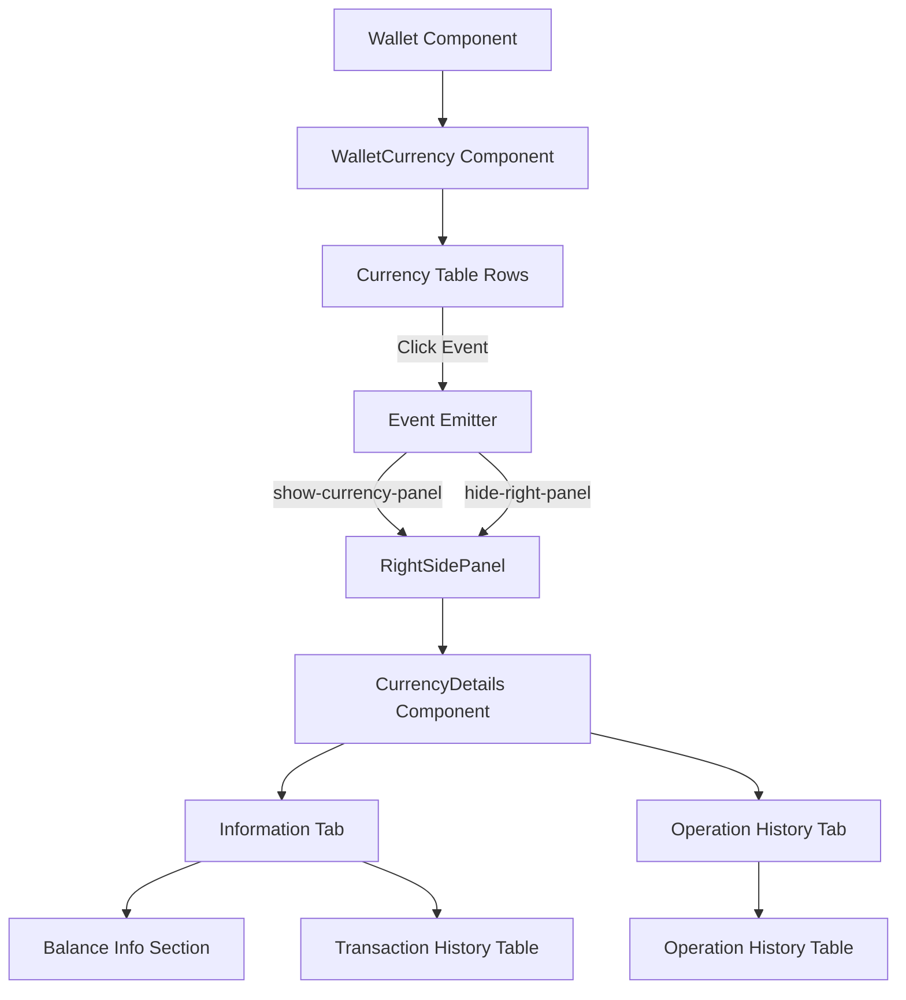
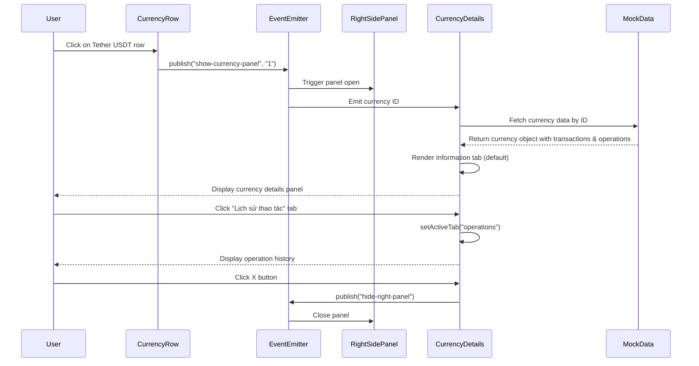

# System Design & Architecture

## Architecture Overview
**What is the high-level system structure?**



**Key components and their responsibilities:**
- **Wallet Component**: Parent container managing tabs and panel state
- **WalletCurrency Component**: Displays currency table and handles row clicks
- **CurrencyDetails Component**: New component showing detailed currency information
- **RightSidePanel**: Existing reusable panel container
- **Event Emitter**: Existing communication mechanism between components

**Technology stack choices and rationale:**
- React 19 with TypeScript for type safety
- Tailwind 4 for styling (matching existing patterns)
- Existing component library (Table, Badge, Tabs, Select, etc.)
- Event emitter pattern for component communication (consistent with WalletDetails)

## Data Models
**What data do we need to manage?**

### Currency Asset Extended Model
```typescript
interface CurrencyAsset {
  id: number;
  name: string;          // e.g., "Tether"
  ticker: string;        // e.g., "USDT"
  icon: string;          // e.g., "usdt"
  totalAssets: string;   // Total balance
  available: string;     // Available balance
  locked: string;        // Locked balance
  usdtValue: string;     // Value in USDT
  status: "active" | "inactive";
  
  // New fields for details panel
  withdrawalStatus: "enabled" | "disabled";  // Rút status
  depositStatus: "enabled" | "disabled";      // Nạp status
  transactions: CurrencyTransaction[];        // Transaction history
  operations: CurrencyOperation[];            // Operation history
}
```

### Currency Transaction Model
```typescript
interface CurrencyTransaction {
  id: string;
  txId: string;              // Transaction ID
  datetime: string;          // e.g., "10.13.2025 - 14:52"
  senderName: string;        // e.g., "Hệ thống" or "Phan Công Kiều"
  senderEmail?: string;      // Optional email
  senderAddress?: string;    // Optional blockchain address
  receiverName: string;      // e.g., "Phan Công Kiều"
  receiverEmail?: string;    // Optional email
  receiverAddress?: string;  // Optional blockchain address
  type: string;              // e.g., "Giao dịch", "Điều chỉnh"
  amount: string;            // e.g., "-5.000000" or "+0.300000"
  balanceAfter: string;      // Balance after transaction
  description: string;       // Transaction description
  status: "approved" | "pending" | "rejected" | "warning";
}
```

### Currency Operation Model
```typescript
interface CurrencyOperation {
  id: string;
  datetime: string;          // e.g., "10.13.2025 - 13:50"
  operatorName: string;      // e.g., "Tuấn Phan"
  operatorEmail: string;     // e.g., "tuanphan@gmail.com"
  actionType: "withdrawal" | "deposit";  // Type of status change
  actionDescription: string; // e.g., "Cập nhật Trạng thái Rút"
  previousStatus: string;    // e.g., "Khoá rút"
  newStatus: string;         // e.g., "Cho rút"
}
```

### Component State
```typescript
interface CurrencyDetailsState {
  selectedCurrencyId: number | null;
  activeTab: "information" | "operations";
  transactionTypeFilter: string;
}
```

## API Design
**How do components communicate?**

### Event Emitter Events
```typescript
// Open currency details panel
publish("show-currency-panel", currencyId: string)

// Close panel
publish("hide-right-panel")
```

### Props Interfaces
```typescript
// CurrencyDetails Component Props
interface CurrencyDetailsProps {
  // Receives currency ID through event emitter
  // Looks up currency data from mock data store
}
```

## Component Breakdown
**What are the major building blocks?**

### 1. WalletCurrency Component (Modified)
**Location:** `src/containers/Wallet/Wallet.tsx` (existing component)
**Responsibilities:**
- Render currency table
- Handle row click events
- Emit `show-currency-panel` event with currency ID

**Changes needed:**
- Add click handler to currency table rows
- Add ChevronRightIcon to indicate clickable rows
- Add hover state styling

### 2. CurrencyDetails Component (New)
**Location:** `src/containers/Wallet/CurrencyDetails.tsx`
**Responsibilities:**
- Listen for `show-currency-panel` event
- Fetch/display selected currency data
- Manage tab state (information vs operations)
- Handle panel close action

**Sub-sections:**
- **Header Section:**
  - Title: "Chi tiết ví tổng"
  - Close button (X icon)
  
- **Tab Controls:**
  - Segment-style tab switcher
  - Two tabs: "Thông tin" and "Lịch sử thao tác"
  
- **Information Tab Content:**
  - Withdrawal status display (red toggle + "Khoá rút" text)
  - Currency name and ticker display
  - Balance breakdown table (4 columns: Tên tài sản, Tổng tài sản, Khả dụng, Đang khoá, Tổng tài sản quy đổi USDT)
  - Transaction type filter dropdown
  - Transaction history table
  
- **Operation History Tab Content:**
  - Operation history table (3 columns: Người thao tác, Thao tác, Thời gian thao tác)

### 3. Reused Components
- `RightSidePanel`: Container for the details panel
- `Table`, `TableHead`, `TableBody`, `TableRow`, `TableHeaderCell`, `TableCell`: For data tables
- `Badge`: For status indicators
- `Select`: For transaction type filter
- `XIcon`: For close button

## Design Decisions
**Why did we choose this approach?**

### 1. Separate Component vs. Extending WalletDetails
**Decision:** Create a new `CurrencyDetails` component instead of extending `WalletDetails`
**Rationale:**
- Clear separation of concerns (user wallets vs. currency wallets)
- Different data structures and requirements
- Easier to maintain and test independently
- Follows single responsibility principle

**Alternatives considered:**
- Extending WalletDetails with conditional rendering → Rejected: Would make component too complex
- Using the same component with different modes → Rejected: Different data models and layouts

### 2. Event Emitter Pattern
**Decision:** Use existing event emitter pattern for panel communication
**Rationale:**
- Consistency with existing WalletDetails implementation
- Loose coupling between components
- Already proven pattern in the codebase

### 3. Mock Data Structure
**Decision:** Embed transaction and operation history directly in currency asset objects
**Rationale:**
- Simpler for initial implementation
- Matches existing pattern in WalletDetails mock data
- Easy to replace with API calls later

### 4. Tab Implementation
**Decision:** Use internal state for tab switching instead of Tabs component
**Rationale:**
- Simpler implementation for two tabs
- More control over custom segment-style UI
- Matches Figma design exactly
- Consistent with WalletDetails pattern

## Component Design Patterns

### 1. Tab Switching Pattern
```typescript
const [activeTab, setActiveTab] = useState<"information" | "operations">("information");

// Segment-style tab UI (matching Figma)
<div className="bg-[#edf2fd] flex h-8 items-center justify-center px-0.5 py-0 rounded-md">
  <button onClick={() => setActiveTab("information")} className={cn(...)}>
    Thông tin
  </button>
  <button onClick={() => setActiveTab("operations")} className={cn(...)}>
    Lịch sử thao tác
  </button>
</div>
```

### 2. Event Listening Pattern
```typescript
useEventListener<string>("show-currency-panel", (currencyId) => {
  setSelectedCurrencyId(Number(currencyId));
  setActiveTab("information");
});
```

### 3. Data Lookup Pattern
```typescript
const currencyData = selectedCurrencyId 
  ? mockCurrencyData[selectedCurrencyId] 
  : null;

if (!currencyData) {
  return null;
}
```

## Non-Functional Requirements
**How should the system perform?**

### Performance targets
- Panel should open within 100ms of row click
- Tab switching should be instantaneous (<50ms)
- Smooth slide-in animation (matching existing panel behavior)
- No flickering or layout shifts

### Scalability considerations
- Should handle currency objects with 100+ transactions
- Implement virtual scrolling if transaction list exceeds viewport (future enhancement)
- Lazy load operation history data (future enhancement)

### Security requirements
- Display-only (no data modification in this phase)
- No sensitive data in console logs
- Maintain existing authentication/authorization checks

### Reliability/availability needs
- Graceful handling of missing data
- Fallback UI for empty transaction/operation lists
- Error boundaries for component isolation

## Styling & Design Tokens

### Color Palette (from Figma)
```typescript
const colors = {
  contentDark: "#021337",           // Primary text
  contentSecondary: "#677187",      // Secondary text
  contentAccent: "#2C2A2A",         // Accent text
  contentWhite: "#FFFFFF",          // White text
  backgroundWhite: "#FFFFFF",       // White background
  backgroundLightBlueGrey: "#EDF2FD", // Tab background
  backgroundLightGrey: "#F2F4F5",   // Outer background
  backgroundPrimary: "#FF3B34",     // Red (for disabled status)
  borderSelected: "#3273F1",        // Selected border
  surfacePlaceholder: "#777E90",    // Placeholder text
};
```

### Typography (from Figma)
```typescript
const typography = {
  headingSmall: "text-[20px] leading-[28px] font-semibold", // Title
  labelXSmall: "text-xs leading-4 font-medium",  // Tab labels
  paragraphSmall: "text-sm leading-5 font-normal", // Body text
  paragraphXSmall: "text-xs leading-4 font-normal", // Small text
  paragraphXXSmall: "text-[10px] leading-[14px] font-normal", // Tiny text
};
```

### Spacing
- Panel padding: 16px
- Gap between sections: 16px
- Table cell padding: 10px vertical, 10px horizontal
- Tab segment height: 32px

## Data Flow Diagram



## Accessibility Considerations

- All interactive elements must be keyboard accessible
- Tab key navigation should work properly
- Close button has proper aria-label
- Tables have proper th/td structure
- Color contrast meets WCAG AA standards
- Focus indicators visible on all interactive elements

