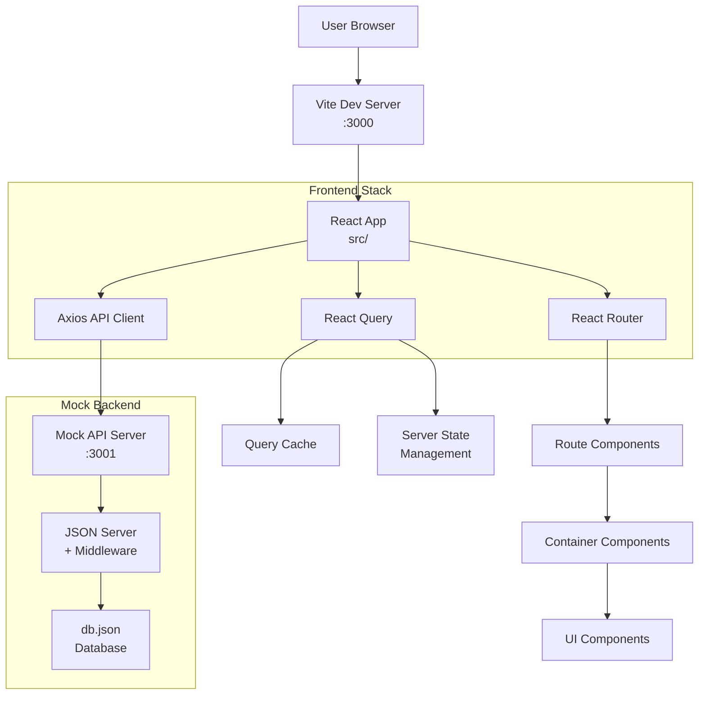
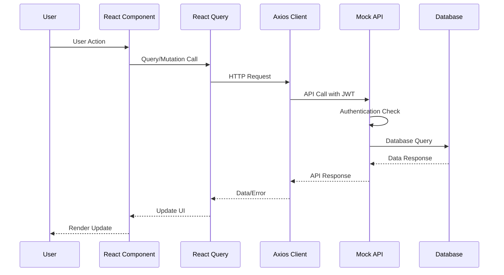
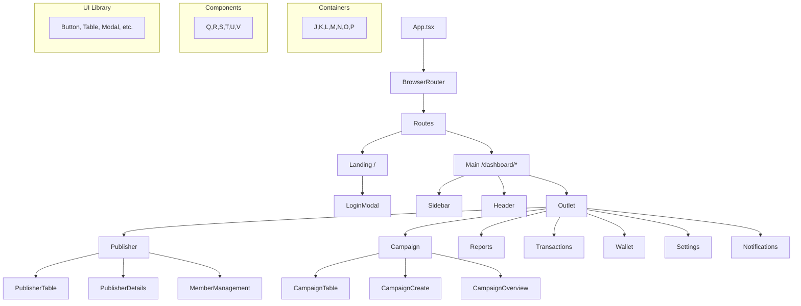

# Main App and Mock API Architecture

## Overview

The OpenKingdom Admin project is a comprehensive React-based admin dashboard built with modern web technologies. It consists of two main components:

**Main Application (`src/`)**: A React 19 + TypeScript admin dashboard for managing publishers, campaigns, transactions, and analytics in what appears to be a blockchain-based referral/affiliate marketing platform.

**Mock API (`mock-api/`)**: A JSON Server-based mock API server that implements a complete REST API with authentication, pagination, filtering, and CRUD operations for all platform entities.

**Technology Stack**:

- **Frontend**: React 19, TypeScript, React Router 7, React Query 5, Tailwind CSS 4, Axios
- **Backend**: JSON Server (Node.js), Express-like middleware
- **Testing**: Vitest, React Testing Library
- **Build**: Vite, ESLint, TypeScript

**Purpose**: Development and testing environment for an admin platform managing a referral/affiliate marketing system with KYC, campaigns, transactions, and user management.

## Implementation Details

### Main Application Architecture

**Entry Point**: `src/main.tsx`

- Standard React 19 entry point using `createRoot`
- Renders `<App />` wrapped in `StrictMode`

**Core Structure**:

```
src/
├── App.tsx                 # Main routing and providers
├── main.tsx               # React root entry point
├── index.css              # Global Tailwind styles
├── components/            # Reusable UI components
│   ├── ui/               # Base components (Button, Table, etc.)
│   ├── auth/             # Authentication components
│   └── [feature]/        # Feature-specific components
├── containers/            # Page-level components
│   ├── Campaign/         # Campaign management
│   ├── Publisher/        # Publisher management
│   ├── Reports/          # Analytics & reporting
│   └── [feature]/        # Other feature containers
├── layout/               # Layout components (Header, Sidebar, Main)
├── lib/                  # Utilities and configuration
│   ├── api.ts           # API client and endpoints
│   ├── queryClient.ts   # React Query configuration
│   └── utils/           # Date, common utilities
├── hooks/               # Custom React hooks
├── context/             # React context providers
├── types.ts             # Global TypeScript types
└── test/                # Test utilities and setup
```

**Routing Structure** (`App.tsx`):

- `/` - Landing page with authentication modal
- `/dashboard/*` - Protected routes with sidebar layout
  - `publishers` - Publisher management
  - `campaigns` - Campaign management (list + create)
  - `reports/publishers|campaigns` - Analytics dashboards
  - `transactions` - Transaction history
  - `wallet` - Wallet management
  - `notifications` - System notifications
  - `settings/*` - Platform settings

**State Management**:

- **React Query**: Server state management with caching
- **Local Storage**: Authentication tokens
- **Context**: Toast notifications, sidebar state
- **React Router**: URL-based routing state

### Mock API Architecture

**Entry Point**: `mock-api/server.js`

- JSON Server instance with custom middleware
- Database loaded from `db.json`
- Runs on port 3001 by default

**Core Features**:

- **Authentication**: Mock OTP flow, JWT token validation
- **CRUD Operations**: Full REST API for all entities
- **Pagination**: Configurable page/limit parameters
- **Filtering**: Advanced search and filter capabilities
- **Sorting**: Multi-field sorting support
- **Data Persistence**: Writes changes back to `db.json`

**API Structure**:

```
Health & Auth:
/health, /auth/otp/*

Publishers:
/admin/publishers/*
├── CRUD operations
├── Member management
├── KYC submissions
├── Notes & activity logs
└── Blacklist management

Campaigns:
/campaigns/*
├── CRUD operations
├── Participant management
├── Analytics & statistics
└── Status controls (activate/pause/end)

Analytics:
/analytics/*
├── dashboard, users, campaigns, revenue
└── Referral analytics

Other Features:
├── /notifications/* - Push notifications
├── /transactions/* - Transaction history
├── /wallets/* - Wallet balances
├── /reports/* - Export functionality
├── /settings/* - Platform configuration
├── /audit-logs/* - Audit trail
└── /system/* - System health & maintenance
```

### Integration Points

**API Client** (`src/lib/api.ts`):

- Axios instance with base URL configuration
- Automatic JWT token injection via interceptors
- Organized API modules (auth, users, publishers, campaigns)
- Environment variable support for API URL

**Authentication Flow**:

1. User enters email → `POST /auth/otp/request`
2. System sends OTP → User enters code → `POST /auth/otp/verify`
3. Token stored in localStorage → Automatic injection in all requests
4. Token validation on protected routes

**Data Flow**:

```
User Action → React Component → React Query → API Client → Mock API → Database
                                      ↓
                              Optimistic Updates ← Error Handling ← Response
```

## Dependencies

### Frontend Dependencies

**Core React Ecosystem**:

- `react@19.1.1` - UI framework with new features
- `react-dom@19.1.1` - React DOM rendering
- `react-router-dom@7.1.0` - Client-side routing
- `@tanstack/react-query@5.62.0` - Server state management

**UI & Styling**:

- `tailwindcss@4.1.0-alpha.35` - Utility-first CSS framework
- `lucide-react@0.468.0` - Icon library
- `flowbite-react@0.12.10` - Component library
- `@tiptap/*` - Rich text editor components

**Data & Forms**:

- `axios@1.7.0` - HTTP client
- `react-hook-form@7.54.0` - Form state management
- `@hookform/resolvers@3.9.0` - Form validation
- `zod@3.24.0` - Schema validation

**Charts & Utils**:

- `recharts@2.15.0` - Chart library
- `date-fns@4.1.0` - Date utilities

### Mock API Dependencies

**Runtime**:

- `json-server@0.17.4` - Mock REST API server
- `path`, `fs`, `url` - Node.js built-ins

### Development Dependencies

**Testing**:

- `vitest@4.0.10` - Test runner
- `@testing-library/react@16.3.0` - React testing utilities
- `@vitest/coverage-v8@4.0.10` - Code coverage

**Build & Dev**:

- `vite@7.1.7` - Build tool and dev server
- `typescript@5.9.3` - Type checking
- `eslint@9.36.0` - Code linting
- `concurrently@9.1.0` - Run multiple processes

## Visual Diagrams

### System Architecture



### Data Flow Architecture



### Component Hierarchy



## Additional Insights

### Architectural Strengths

1. **Modern React Patterns**: Uses React 19 features, React Query for state management, and proper component composition
2. **Type Safety**: Full TypeScript implementation with proper interfaces
3. **Developer Experience**: Hot reloading, comprehensive testing setup, ESLint configuration
4. **Scalable Structure**: Clear separation between containers (pages) and components (reusable UI)
5. **API Design**: RESTful conventions, consistent error handling, pagination support

### Integration Benefits

1. **Development Speed**: Mock API allows frontend development without backend dependencies
2. **Contract Testing**: API contract defined in `api-contract.yaml` ensures consistency
3. **Realistic Testing**: Comprehensive mock data with relationships and edge cases
4. **Environment Flexibility**: Environment variable configuration for different API endpoints

### Current Limitations

1. **Mock Data Constraints**: JSON Server limitations on complex queries and relationships
2. **Authentication Simplicity**: Basic JWT validation without refresh token logic
3. **Real-time Features**: No WebSocket or SSE support for live updates
4. **Performance**: No caching layer beyond React Query client-side caching

### Potential Improvements

1. **State Management**: Consider Zustand or Redux Toolkit for complex client state
2. **API Layer**: Add request/response interceptors for better error handling
3. **Testing**: Expand integration tests between frontend and mock API
4. **Performance**: Implement React 19's new features (useOptimistic, Actions API)
5. **Real API Migration**: Plan for transition from mock to real backend API

## Metadata

- **Analysis Date**: November 18, 2025
- **Analysis Depth**: Architecture-level (entry points, major components, data flow)
- **Files Analyzed**: 15+ core files across frontend and mock API
- **Primary Focus**: System architecture, integration patterns, technology choices
- **Entry Points**: `src/` (React app), `mock-api/` (JSON Server API)
- **Key Technologies**: React 19, TypeScript, React Query, JSON Server, Tailwind CSS 4

## Next Steps

1. **Deep Dive**: Analyze specific feature modules (Campaign, Publisher management)
2. **API Contract Review**: Examine `mock-api/api-contract.yaml` for complete API specification
3. **Component Analysis**: Review reusable component patterns and design system
4. **Testing Strategy**: Evaluate current test coverage and expansion opportunities
5. **Performance Audit**: Assess current optimization strategies and identify improvements
6. **Migration Planning**: Create plan for transitioning from mock API to production backend

---

**Note**: This knowledge document provides a comprehensive overview of the system's architecture. For detailed implementation of specific features, refer to individual component or module analyses.
