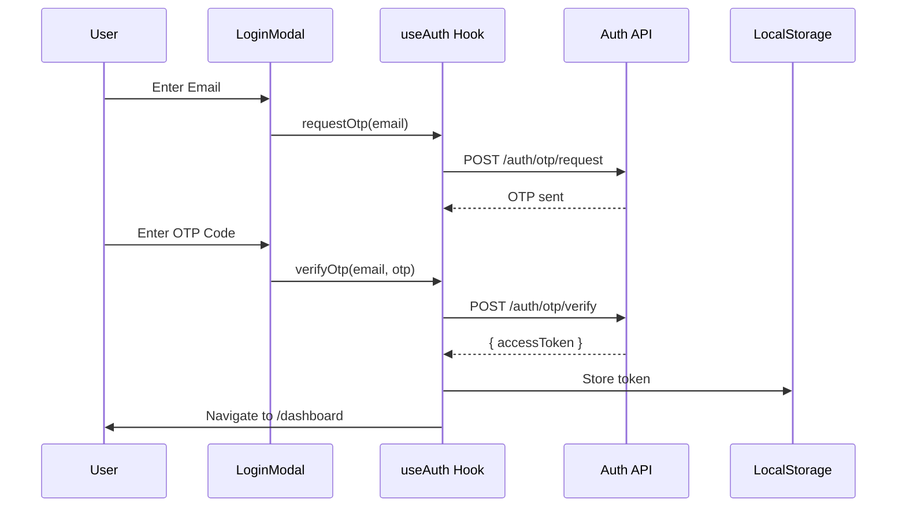
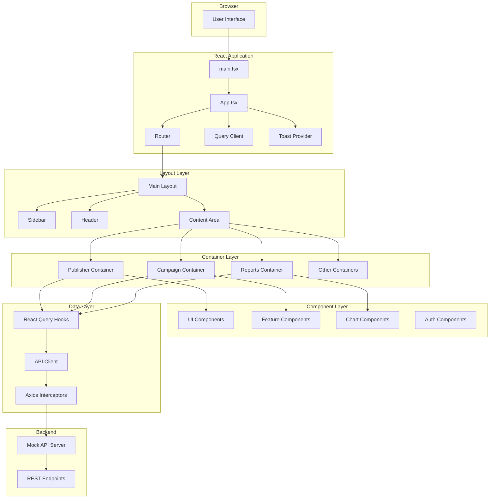
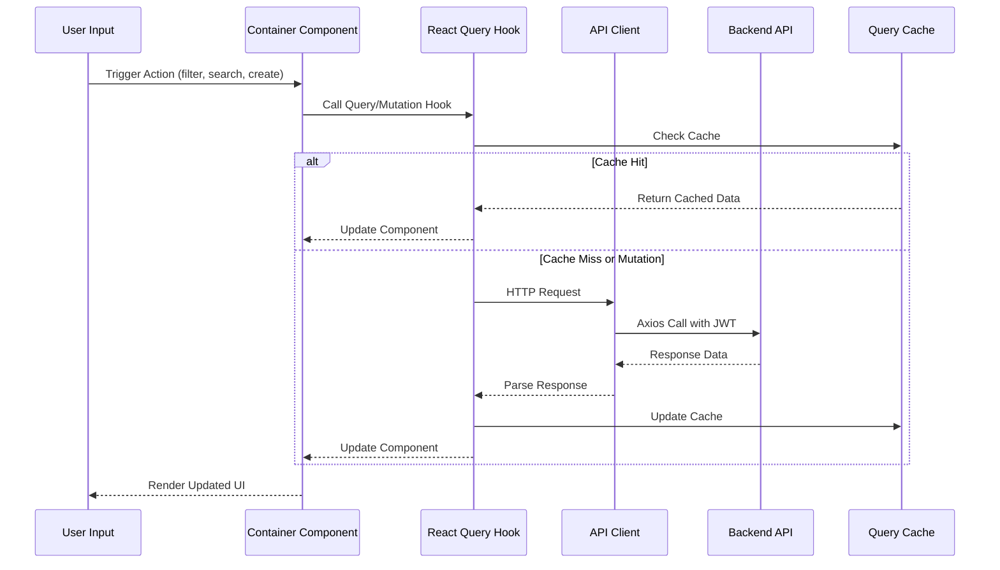
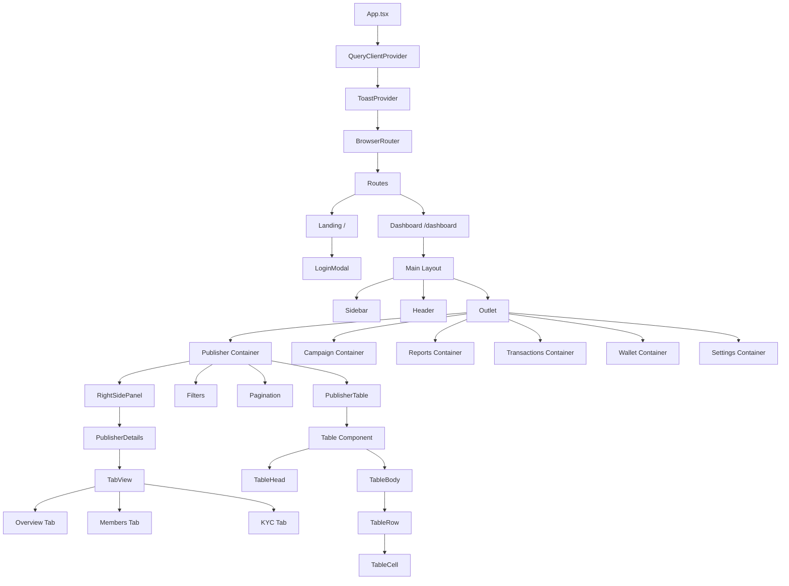
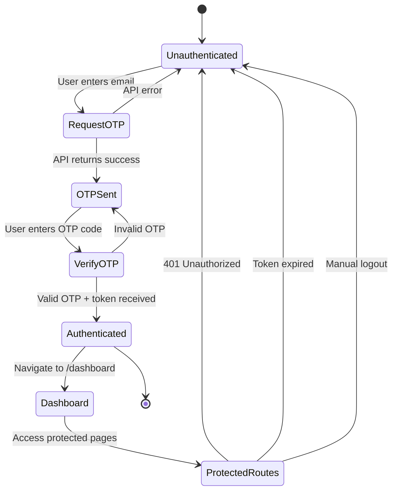

# Onboarding: Complete src/* Codebase Architecture

## Overview

The OpenKingdom Admin is a comprehensive React-based admin dashboard for managing a blockchain-based referral/affiliate marketing platform. This document provides a complete architectural overview of the `src/` directory to help new developers understand the codebase structure, patterns, and key implementations.

**Technology Stack:**
- **Frontend Framework**: React 19.1.1 with TypeScript
- **Routing**: React Router 7.1.0
- **State Management**: React Query 5.62.0 (server state) + React Context (client state)
- **Styling**: Tailwind CSS 4.1.0-alpha with `tailwind-variants` for component styling
- **Form Handling**: React Hook Form 7.54.0 with Zod 3.24.0 validation
- **HTTP Client**: Axios 1.7.0
- **Rich Text**: TipTap 3.10.1
- **Charts**: Recharts 2.15.0
- **Icons**: Lucide React 0.468.0
- **Build Tool**: Vite 7.1.7
- **Testing**: Vitest 4.0.10

**Purpose**: Provide administrators with tools to manage publishers, campaigns, transactions, KYC verification, wallets, and analytics for a referral marketing platform.

---

## Implementation Details

### Entry Points

#### 1. Application Bootstrap (`src/main.tsx`)

```typescript
├── Renders React app into DOM using createRoot (React 19)
├── Wraps App in StrictMode for development warnings
└── Imports global styles from index.css
```

**Key Features:**
- React 19's `createRoot` API for concurrent rendering
- StrictMode enabled for detecting potential issues
- Single entry point for the entire application

#### 2. Application Root (`src/App.tsx`)

The main application orchestrator that sets up:

**Provider Hierarchy:**
```
QueryClientProvider (React Query for server state)
  └── ToastProvider (Global notification system)
      └── BrowserRouter (Client-side routing)
          └── Routes (Route definitions)
```

**Route Structure:**
- **Landing Route** (`/`): Public landing page with authentication modal
- **Dashboard Routes** (`/dashboard/*`): Protected admin interface with nested routes
  - `publishers` - Publisher management (list + details)
  - `campaigns` - Campaign management (list + create)
  - `reports/publishers` - Publisher analytics dashboard
  - `reports/campaigns` - Campaign analytics dashboard
  - `transactions` - Transaction history and management
  - `wallet` - Wallet balances and currency management
  - `notifications` - System notifications
  - `settings/*` - Platform settings and configuration
    - `income-per-tier` - Tier-based income configuration

**Key Patterns:**
- Protected routes wrap authenticated content using `<ProtectedRoute>`
- Nested routing with `<Outlet>` for dashboard layout
- Default redirects for better UX (e.g., `/dashboard` → `/dashboard/publishers`)
- React Query DevTools included for development

---

### Directory Structure

```
src/
├── main.tsx                    # React entry point
├── App.tsx                     # Root component with routing
├── index.css                   # Global styles and Tailwind setup
├── types.ts                    # Global TypeScript interfaces
│
├── components/                 # Reusable UI components
│   ├── ui/                    # Base design system components
│   ├── auth/                  # Authentication components
│   ├── charts/                # Chart components (Recharts wrappers)
│   └── features/              # Feature-specific shared components
│
├── containers/                 # Page-level container components
│   ├── Landing/               # Landing page
│   ├── Publisher/             # Publisher management pages
│   ├── Campaign/              # Campaign management pages
│   ├── Reports/               # Analytics dashboards
│   ├── Transactions/          # Transaction pages
│   ├── Wallet/                # Wallet management
│   ├── Notifications/         # Notifications page
│   ├── Settings/              # Settings pages
│   └── IncomePerTier/         # Income tier configuration
│
├── layout/                     # Layout components
│   ├── Main.tsx               # Main dashboard layout
│   ├── Header.tsx             # Top header bar
│   ├── Sidebar.tsx            # Desktop sidebar navigation
│   └── MobileSidebar.tsx      # Mobile bottom navigation
│
├── lib/                        # Core utilities and configuration
│   ├── api.ts                 # Axios instance and API endpoints
│   ├── queryClient.ts         # React Query configuration
│   ├── queries/               # React Query hooks
│   ├── utils/                 # Utility functions
│   └── mock-data/             # Client-side mock data
│
├── hooks/                      # Custom React hooks
│   ├── useAuth.ts             # Authentication hook
│   ├── use-mobile.tsx         # Mobile detection hook
│   ├── useClickOutside.ts     # Click outside detection
│   └── useEventEmitter.ts     # Event bus for component communication
│
├── context/                    # React Context providers
│   ├── toast/                 # Toast notification system
│   └── sidebar/               # Sidebar state management
│
├── icon/                       # Custom SVG icon components
└── assets/                     # Static assets (images, logos)
```

---

### Core Architecture Patterns

#### 1. Authentication Flow

**Components:**
- `LoginModal.tsx` - Two-step OTP authentication UI
- `ProtectedRoute.tsx` - Route guard component
- `useAuth.ts` - Authentication hook with mutations

**Flow:**


**Key Features:**
- JWT token stored in localStorage
- Automatic token injection via Axios interceptors
- 401 response handling with auto-redirect to login
- Protected route wrapper with loading states
- Location state preservation for redirect after login

#### 2. State Management Strategy

**Server State (React Query):**
- All API data cached and synchronized via React Query
- Custom hooks in `lib/queries/` for each resource
- Automatic cache invalidation on mutations
- 5-minute stale time, 1 retry on failure

**Client State (React Context + Local State):**
- Toast notifications: `ToastContext`
- Sidebar visibility: `SidebarContext`
- Component-level state: `useState` for form inputs, filters, pagination

**Example Query Hook Pattern:**

```typescript
// lib/queries/useCampaigns.ts
export function useCampaigns(page, pageSize, filters) {
  return useQuery({
    queryKey: ['campaigns', page, pageSize, filters],
    queryFn: () => campaignsApi.getCampaigns({ page, limit: pageSize, ...filters }),
  });
}

export function useCreateCampaign() {
  const queryClient = useQueryClient();
  const { success, error } = useToast();
  
  return useMutation({
    mutationFn: (data) => campaignsApi.createCampaign(data),
    onSuccess: () => {
      queryClient.invalidateQueries({ queryKey: ['campaigns'] });
      success('Campaign created successfully');
    },
    onError: () => error('Failed to create campaign'),
  });
}
```

#### 3. API Layer Architecture

**Axios Configuration (`lib/api.ts`):**
```typescript
// Base instance with environment-based URL
const api = axios.create({
  baseURL: import.meta.env.VITE_API_URL,
  headers: { 'Content-Type': 'application/json' }
});

// Request interceptor: Inject JWT token
api.interceptors.request.use((config) => {
  const token = localStorage.getItem('authToken');
  if (token) {
    config.headers.Authorization = `Bearer ${token}`;
  }
  return config;
});

// Response interceptor: Handle 401 unauthorized
api.interceptors.response.use(
  (response) => response,
  (error) => {
    if (error.response?.status === 401) {
      localStorage.removeItem('authToken');
      window.location.href = '/';
    }
    return Promise.reject(error);
  }
);
```

**API Modules:**
- `authApi` - OTP request/verify
- `usersApi` - User CRUD operations
- `publishersApi` - Publisher management
- `campaignsApi` - Campaign management

**Pagination Pattern:**
All list endpoints return:
```typescript
{
  data: T[],
  total: number  // From X-Total-Count header
}
```

#### 4. Component Architecture Patterns

**Container Components:**
Located in `containers/`, these are page-level components responsible for:
- Data fetching via React Query hooks
- State management (filters, pagination, search)
- Event handling and navigation
- Layout composition

**Example: Publisher Container Pattern**
```typescript
export function Publisher() {
  // Data fetching
  const { data, isLoading, error } = usePublishers(page, limit, filters);
  
  // Local state
  const [searchQuery, setSearchQuery] = useState('');
  const [filters, setFilters] = useState({...});
  const [currentPage, setCurrentPage] = useState(1);
  
  // Event handlers
  const handlePublisherClick = (id) => {
    publish('show-right-panel', id);
  };
  
  // Render UI components
  return (
    <div>
      <SearchInput onChange={setSearchQuery} />
      <PublisherTable data={data} onRowClick={handlePublisherClick} />
      <Pagination ... />
      <RightSidePanel>
        <PublisherDetails />
      </RightSidePanel>
    </div>
  );
}
```

**UI Components:**
Located in `components/ui/`, these are reusable building blocks:
- Built with TypeScript and strict prop types
- Styled with Tailwind + `tailwind-variants` for variant management
- Fully tested with Vitest
- Responsive by default with mobile-first approach

**Key UI Components:**
- `Table` - Flexible table with sticky columns and horizontal scroll
- `Button` - Variant-based button (primary, secondary, danger, ghost)
- `Modal` - Accessible modal with portal rendering
- `DateRangeInput` - UTC-based date range picker with mobile bottom sheet
- `MultipleSelectDropdown` - Multi-select with checkboxes
- `SearchInput` - Debounced search input
- `Pagination` - Table pagination with rows-per-page selector

#### 5. Responsive Design System

**Breakpoints:**
```css
/* index.css */
@theme {
  --breakpoint-pn: 899px;  /* Primary navigation breakpoint */
}
```

**Mobile Detection:**
```typescript
// hooks/use-mobile.tsx
const MOBILE_BREAKPOINT = 430;

export function useIsMobile() {
  // Detects viewport width < 430px
  // Used for conditional rendering of mobile/desktop UIs
}
```

**Mobile Patterns:**
- Desktop: Sticky sidebar + header + content area
- Mobile: Bottom navigation bar (MobileSidebar)
- Responsive tables: Horizontal scroll with sticky columns
- Mobile overlays: Bottom sheets for filters, pickers

#### 6. Event Communication Pattern

**Custom Event Bus (`useEventEmitter`):**
```typescript
// Usage in containers
const { publish, subscribe } = useEventEmitter();

// Publish events
publish('title-change', { title: 'Publisher' });
publish('show-right-panel', publisherId);

// Subscribe to events
useEffect(() => {
  const unsubscribe = subscribe('title-change', (data) => {
    setTitle(data.title);
  });
  return unsubscribe;
}, []);
```

**Common Events:**
- `title-change` - Update page title in header
- `show-right-panel` - Open right-side detail panel
- `close-right-panel` - Close right-side detail panel

---

### Key Features by Module

#### Authentication (`components/auth/`)

**LoginModal.tsx**
- Two-step OTP authentication flow
- Email validation with Zod schema
- 6-digit OTP input with auto-focus and paste support
- Resend OTP with loading states
- Error handling and toast notifications

**ProtectedRoute.tsx**
- Route guard for authenticated pages
- Token validation from localStorage
- Loading state during authentication check
- Auto-redirect to landing with location state preservation

#### Layout System (`layout/`)

**Main.tsx**
- Flex-based dashboard layout
- Desktop sidebar + mobile bottom navigation
- Header with dynamic title
- Content area with vertical scroll
- React Router `<Outlet>` for nested routes

**Sidebar.tsx (Desktop)**
- Collapsible navigation menu
- Active route highlighting
- Icon + label navigation items
- User profile section
- Logout functionality

**MobileSidebar.tsx**
- Fixed bottom navigation bar
- Icon-only navigation items
- Active state indicators

**Header.tsx**
- Breadcrumb navigation
- Dynamic page title (via event bus)
- User profile dropdown
- Notification badge

#### Publisher Management (`containers/Publisher/`)

**Publisher.tsx**
- Advanced filtering: search, date range, country, status, member count
- Debounced search (500ms delay)
- Pagination with customizable rows per page
- Click to view details in right panel
- Real-time data with React Query

**PublisherDetails.tsx**
- Tabbed interface: Overview, Info, Members, KYC, History
- Publisher action dropdown (suspend, ban, activate)
- Member management with tier tracking
- KYC approval workflow

**PublisherTable.tsx**
- Customizable columns with sorting
- Click handlers for row navigation
- Badge components for status visualization
- Country flags and localized data

#### Campaign Management (`containers/Campaign/`)

**Campaign.tsx**
- Multi-filter system: search, date range, country, type, status
- Create campaign button
- Table view with pagination
- Right panel for campaign creation/editing

**CampaignCreate.tsx**
- Rich text editor for campaign description (TipTap)
- Date range picker for campaign duration
- Reward configuration per tier
- Whitelist/blacklist management
- Image upload for campaign assets

**CampaignOverviewTab.tsx**
- Campaign statistics and metrics
- Participant tracking
- Budget vs. spent visualization
- Status management (activate, pause, end)

#### Reports & Analytics (`containers/Reports/`)

**ReportsPublishers.tsx**
- Time-based analytics with date range filter
- Publisher performance metrics
- Activity charts (Recharts line charts)
- Top performers table
- Export functionality

**ReportsCampaigns.tsx**
- Campaign performance dashboard
- ROI and conversion rate metrics
- Comparison charts
- Budget tracking

#### UI Component Library (`components/ui/`)

**Table Component System**
```typescript
<Table horizontalScrollWithStickyColumns>
  <TableHead>
    <TableRow>
      <TableHeaderCell data-sticky="left-1">#</TableHeaderCell>
      <TableHeaderCell data-sticky="left-2">Name</TableHeaderCell>
      <TableHeaderCell>Email</TableHeaderCell>
    </TableRow>
  </TableHead>
  <TableBody>
    <TableRow onClick={handleClick}>
      <TableCell data-sticky="left-1">1</TableCell>
      <TableCell data-sticky="left-2">John Doe</TableCell>
      <TableCell>john@example.com</TableCell>
    </TableRow>
  </TableBody>
</Table>
```

**Features:**
- Sticky columns (left-1, left-2, right)
- Gradient shadows for scroll indication
- Click handlers on rows and cells
- Responsive horizontal scroll
- Customizable alignment (left, center, right)

**DateRangeInput Component**
```typescript
<DateRangeInput
  value={{ start: utcTimestamp, end: utcTimestamp }}
  onChange={(range) => setDateRange(range)}
  className="w-40"
/>
```

**Features:**
- UTC timestamp-based date range (`{ start: number, end: number }`)
- Desktop: Popover with dual month calendar
- Mobile: Bottom sheet with dual month calendar
- "Apply" and "Default" actions
- Visual range selection with hover states

**MultipleSelectDropdown Component**
```typescript
<MultipleSelectDropdown
  options={[{ value: 'VN', label: 'Việt Nam' }, ...]}
  onSelectedChange={(selected) => setFilters(selected)}
  placeholder="Select Country"
/>
```

**Features:**
- Checkbox-based multi-selection
- "Select All" functionality
- Badge display for selected items
- Searchable dropdown

---

## Dependencies

### Production Dependencies

**Core React:**
- `react@19.1.1`, `react-dom@19.1.1` - Latest React with concurrent features
- `react-router-dom@7.1.0` - Client-side routing

**State Management:**
- `@tanstack/react-query@5.62.0` - Server state management
- `@tanstack/react-query-devtools@5.62.0` - Development tools

**Forms & Validation:**
- `react-hook-form@7.54.0` - Form state management
- `@hookform/resolvers@3.9.0` - Form validation adapters
- `zod@3.24.0` - Schema validation

**UI & Styling:**
- `tailwindcss@4.1.0-alpha.35` - Utility-first CSS
- `tailwind-merge@3.4.0` - Merge Tailwind classes
- `tailwind-variants@3.2.2` - Component variant management
- `flowbite-react@0.12.10` - UI component library
- `lucide-react@0.468.0` - Icon library

**Rich Text Editor:**
- `@tiptap/react@3.10.1` - React wrapper
- `@tiptap/starter-kit@3.10.1` - Basic editor features
- `@tiptap/extension-*` - Additional extensions (link, image, etc.)

**Data Visualization:**
- `recharts@2.15.0` - Chart library

**HTTP & Utilities:**
- `axios@1.7.0` - HTTP client
- `date-fns@4.1.0` - Date manipulation

### Development Dependencies

**Build & Dev Tools:**
- `vite@7.1.7` - Build tool and dev server
- `@vitejs/plugin-react@5.0.4` - React plugin for Vite
- `typescript@5.9.3` - TypeScript compiler
- `@tailwindcss/vite@4.1.0-alpha.35` - Tailwind Vite plugin

**Testing:**
- `vitest@4.0.10` - Test runner
- `@testing-library/react@16.3.0` - React testing utilities
- `@testing-library/jest-dom@6.9.1` - Jest DOM matchers
- `@vitest/coverage-v8@4.0.10` - Code coverage

**Linting:**
- `eslint@9.36.0` - JavaScript/TypeScript linter
- `eslint-plugin-react-hooks@5.2.0` - React Hooks rules
- `eslint-plugin-react-compiler@19.1.0-rc.2` - React compiler plugin
- `typescript-eslint@8.45.0` - TypeScript ESLint

**Development Utilities:**
- `concurrently@9.1.0` - Run multiple processes
- `json-server@0.17.4` - Mock API server

---

## Visual Diagrams

### Application Architecture



### Data Flow Pattern



### Component Hierarchy



### Authentication Flow



---

## Additional Insights

### Architectural Strengths

1. **Modern React Patterns**
   - React 19 with concurrent features
   - Server state separation with React Query
   - Compound component patterns (Table, Tabs)
   - Custom hooks for reusable logic

2. **Type Safety**
   - Full TypeScript implementation
   - Strict interfaces for all data models
   - Type-safe API calls and responses
   - Zod schemas for runtime validation

3. **Performance Optimizations**
   - React Query caching (5-minute stale time)
   - Debounced search inputs (500ms)
   - Lazy loading with React Router code splitting
   - Memoized expensive computations
   - Virtual scrolling for large tables (where applicable)

4. **Developer Experience**
   - Hot module replacement (HMR) with Vite
   - React Query DevTools for debugging
   - Comprehensive testing setup
   - ESLint configuration with React-specific rules
   - TypeScript strict mode

5. **Scalable Architecture**
   - Clear separation of concerns (containers vs components)
   - Modular API layer
   - Centralized state management
   - Reusable UI component library
   - Event-based communication for loosely coupled components

### Design Patterns Used

1. **Container/Presentational Pattern**
   - Containers (`containers/`) handle logic and data fetching
   - Presentational components (`components/`) handle UI rendering

2. **Compound Component Pattern**
   - `Table`, `TableHead`, `TableBody`, `TableRow`, `TableCell`
   - Provides flexible, composable APIs

3. **Custom Hook Pattern**
   - `useAuth`, `useIsMobile`, `useEventEmitter`
   - Encapsulate reusable logic

4. **Provider Pattern**
   - `QueryClientProvider`, `ToastProvider`
   - Share state across component tree

5. **Higher-Order Component Pattern**
   - `ProtectedRoute` wraps components with authentication logic

### Mobile-First Responsive Strategy

**Breakpoint Philosophy:**
- Mobile: < 430px (phones)
- Tablet: 430px - 899px (not explicitly defined but handled)
- Desktop: > 899px

**Responsive Techniques:**
- Tailwind responsive prefixes (`md:`, `lg:`)
- `useIsMobile()` hook for conditional rendering
- Mobile-specific components (BottomSheet, MobileSidebar)
- Sticky columns for horizontal scrolling tables
- Touch-friendly button sizes and spacing

### Error Handling Strategy

**API Errors:**
- Axios interceptors catch 401 → redirect to login
- React Query `onError` callbacks show toast notifications
- Network errors display user-friendly messages

**Form Validation:**
- Zod schemas for type-safe validation
- React Hook Form integration
- Real-time validation feedback
- Error messages in Vietnamese

**Boundary Errors:**
- Loading states for async operations
- Error states with retry mechanisms
- Fallback UI for failed data loads

### Testing Strategy

**Unit Tests:**
- Vitest for component testing
- React Testing Library for user-centric tests
- Coverage reports with v8

**Test Patterns:**
- Component rendering tests
- User interaction tests
- Hook behavior tests
- API mock responses

**Coverage Goals:**
- UI components: High coverage (>80%)
- Containers: Integration tests
- Utilities: Full coverage (100%)

---

## Common Development Workflows

### Adding a New Page/Feature

1. **Create Container Component**
   ```
   src/containers/NewFeature/NewFeature.tsx
   ```

2. **Add Route in App.tsx**
   ```typescript
   <Route path="new-feature" element={<NewFeature />} />
   ```

3. **Create API Endpoints**
   ```typescript
   // lib/api.ts
   export const newFeatureApi = {
     getItems: async () => { ... },
     createItem: async (data) => { ... }
   };
   ```

4. **Create React Query Hooks**
   ```typescript
   // lib/queries/useNewFeature.ts
   export function useNewFeatureItems() {
     return useQuery({
       queryKey: ['newFeature'],
       queryFn: () => newFeatureApi.getItems()
     });
   }
   ```

5. **Build UI Components**
   ```typescript
   // containers/NewFeature/NewFeature.tsx
   export function NewFeature() {
     const { data, isLoading } = useNewFeatureItems();
     // ... render UI
   }
   ```

6. **Add Navigation**
   - Update `Sidebar.tsx` with new menu item
   - Update `MobileSidebar.tsx` for mobile navigation

### Creating a New UI Component

1. **Create Component File**
   ```
   src/components/ui/NewComponent.tsx
   ```

2. **Define TypeScript Interface**
   ```typescript
   interface NewComponentProps {
     variant?: 'primary' | 'secondary';
     children: ReactNode;
   }
   ```

3. **Add Tailwind Variants**
   ```typescript
   const newComponent = tv({
     base: 'px-4 py-2',
     variants: {
       variant: {
         primary: 'bg-blue-500 text-white',
         secondary: 'bg-gray-200 text-black'
       }
     }
   });
   ```

4. **Implement Component**
   ```typescript
   export function NewComponent({ variant, children }: NewComponentProps) {
     return (
       <div className={newComponent({ variant })}>
         {children}
       </div>
     );
   }
   ```

5. **Add Tests**
   ```
   src/components/ui/NewComponent.test.tsx
   ```

### Adding API Integration

1. **Define TypeScript Types**
   ```typescript
   // types.ts
   export interface NewResource {
     id: number;
     name: string;
     status: 'active' | 'inactive';
   }
   ```

2. **Create API Methods**
   ```typescript
   // lib/api.ts
   export const newResourceApi = {
     getAll: async () => {
       const response = await api.get('/new-resources');
       return response.data;
     },
     getById: async (id: string) => {
       const response = await api.get(`/new-resources/${id}`);
       return response.data;
     }
   };
   ```

3. **Create Query Hooks**
   ```typescript
   // lib/queries/useNewResource.ts
   export function useNewResources() {
     return useQuery({
       queryKey: ['newResources'],
       queryFn: () => newResourceApi.getAll()
     });
   }
   
   export function useNewResource(id: string) {
     return useQuery({
       queryKey: ['newResource', id],
       queryFn: () => newResourceApi.getById(id),
       enabled: !!id
     });
   }
   ```

---

## Metadata

- **Document Created**: December 4, 2025
- **Analysis Depth**: Comprehensive architecture review (all major modules)
- **Files Analyzed**: 50+ files across src/ directory
- **Focus Areas**: 
  - Entry points and application bootstrap
  - Component architecture and patterns
  - State management strategies
  - API layer and data fetching
  - Routing and navigation
  - Authentication and authorization
  - UI component library
  - Mobile responsive design
  - Testing patterns
- **Key Technologies**: React 19, TypeScript, React Query, Tailwind CSS 4, Vite 7
- **Excluded**: `mock-api/` directory (as requested)

---

## Next Steps for Onboarding

### Week 1: Foundation
1. **Environment Setup**
   - Clone repository and install dependencies (`yarn install`)
   - Run development server (`yarn dev:all`)
   - Explore running application and test features
   - Review this knowledge document thoroughly

2. **Code Exploration**
   - Read through `App.tsx` and understand routing structure
   - Examine authentication flow (`LoginModal`, `ProtectedRoute`, `useAuth`)
   - Study one container component end-to-end (recommend: `Publisher`)

3. **Component Library**
   - Review UI components in `components/ui/`
   - Build understanding of `Table`, `Button`, `DateRangeInput`
   - Run tests with `yarn test` to see examples

### Week 2: Feature Development
1. **Pick a Simple Feature**
   - Add a new filter to Publisher or Campaign page
   - Create a new UI component
   - Add a new page with routing

2. **API Integration**
   - Study `lib/api.ts` and axios configuration
   - Review React Query hooks in `lib/queries/`
   - Create a new query hook for practice

3. **Testing**
   - Write unit tests for a UI component
   - Add integration test for a container
   - Run coverage report (`yarn test:coverage`)

### Week 3: Advanced Topics
1. **Mobile Responsiveness**
   - Study `useIsMobile` hook usage
   - Review mobile vs desktop rendering patterns
   - Test application on mobile viewport

2. **State Management**
   - Deep dive into React Query caching strategies
   - Understand optimistic updates and cache invalidation
   - Review event emitter pattern for component communication

3. **Performance**
   - Profile components with React DevTools
   - Review debouncing and memoization patterns
   - Understand code splitting with React Router

### Reference Materials
- **React Query Docs**: https://tanstack.com/query/latest/docs/react/overview
- **Tailwind CSS v4**: https://tailwindcss.com/docs
- **React Router v7**: https://reactrouter.com/en/main
- **Zod Validation**: https://zod.dev/
- **TipTap Editor**: https://tiptap.dev/

### Support Channels
- Review existing implementation plan documents in `docs/ai/planning/`
- Check test files for usage examples
- Refer to this knowledge doc for architectural questions

---

**Document Version**: 1.0  
**Last Updated**: December 4, 2025  
**Maintained By**: Development Team
