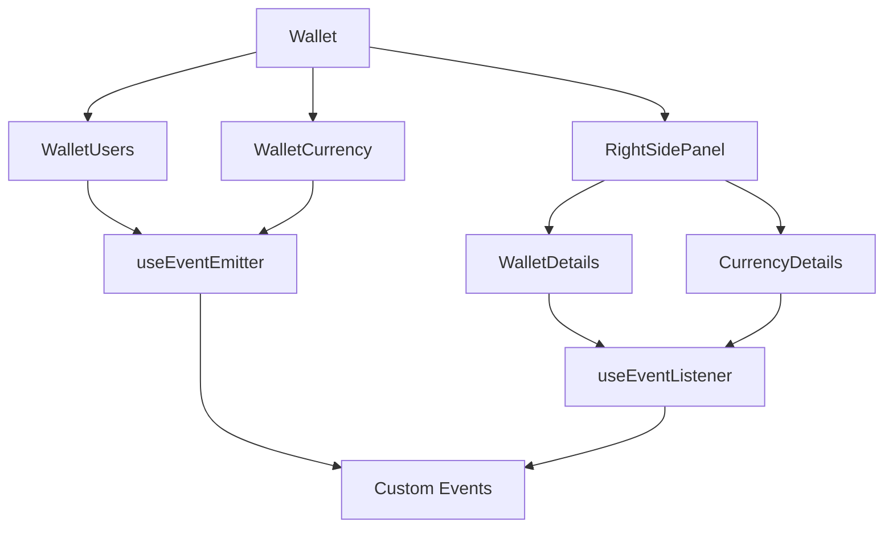
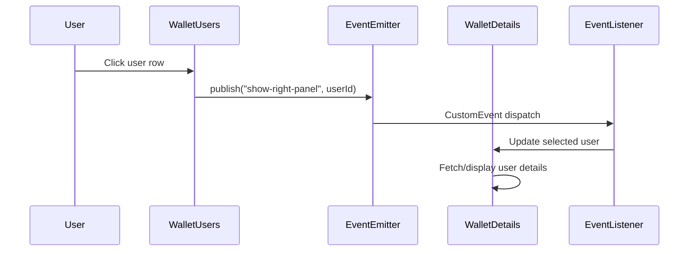
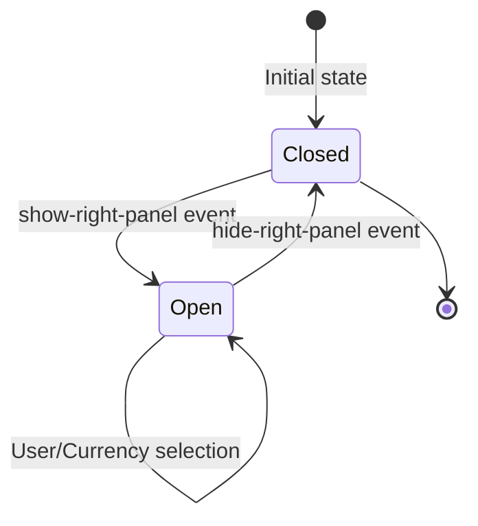

# Knowledge: Wallet Container

## Overview

The Wallet container (`src/containers/Wallet/`) is a comprehensive wallet management feature for the OpenKingdom admin dashboard. It provides administrators with tools to monitor and manage user wallets, cryptocurrency assets, and transaction histories across the platform.

### Purpose and Context

The Wallet feature serves as a financial oversight system within the OpenKingdom ecosystem, enabling administrators to:

- **Monitor User Assets**: View individual user wallet balances, transaction histories, and account statuses
- **Manage Cryptocurrency Holdings**: Track platform-wide cryptocurrency reserves and withdrawal statuses
- **Audit Financial Operations**: Review transaction records and administrative actions
- **Ensure Compliance**: Monitor account statuses and operational history

### Key Capabilities

1. **Dual-Tab Interface**: Separate views for user wallets and currency assets
2. **Real-time Data Display**: Balance information, transaction histories, and operational logs
3. **Interactive Detail Panels**: Right-side panels showing comprehensive details for selected items
4. **Status Management**: Visual indicators for account statuses, transaction approvals, and withdrawal capabilities
5. **Search and Filtering**: Advanced filtering options for large datasets

### Technology Stack

- **React 19**: Leverages modern React features with functional components
- **TypeScript**: Full type safety with comprehensive interfaces
- **Tailwind CSS 4**: Utility-first styling with custom design system
- **Event-Driven Architecture**: Custom event system for component communication

## Implementation Details

### Core Architecture

The Wallet container follows a modular architecture with clear separation of concerns:

```
Wallet Container
├── Wallet.tsx (Main orchestrator)
├── WalletUsers.tsx (User wallet list)
├── WalletCurrency.tsx (Currency asset list)
├── WalletDetails.tsx (User wallet details panel)
├── CurrencyDetails.tsx (Currency details panel)
├── walletUtils.ts (Shared utilities and types)
└── walletUtils.tsx (Duplicate - should be removed)
```

### Component Hierarchy

```12:51:src/containers/Wallet/Wallet.tsx
export function Wallet() {
  const { publish } = useEventEmitter();
  const [activeTab, setActiveTab] = useState<"users" | "currency">("users");

  useEffect(() => {
    publish("title-change", { title: "Ví" });
  }, [publish]);

  const handleUserSelect = (userId: number) => {
    publish("show-right-panel", userId.toString());
  };

  return (
    <div className="flex flex-col gap-4">
      {/* Wallet Section */}
      <Tabs
        tabs={[
          { id: "users", label: "Người dùng" },
          { id: "currency", label: "Đơn vị tiền" },
        ]}
        defaultTab="users"
        onTabChange={(tabId) => setActiveTab(tabId as "users" | "currency")}
      >
        {() => (
          <div className="flex flex-col gap-4 border-t border-[#CFD6DE] p-3 w-full">
            {activeTab === "users" ? (
              <WalletUsers onUserSelect={handleUserSelect} />
            ) : (
              <WalletCurrency />
            )}
          </div>
        )}
      </Tabs>

      {/* Right-side Panel */}
      <RightSidePanel>
        <WalletDetails />
        <CurrencyDetails />
      </RightSidePanel>
    </div>
  );
}
```

### Event-Driven Communication

The Wallet container uses a custom event system for inter-component communication:

```5:15:src/hooks/useEventEmitter.ts
export function useEventEmitter() {
  const publish = useCallback(<T = any>(eventName: string, data?: T) => {
    const event = new CustomEvent(eventName, {
      detail: data,
      bubbles: false,
      cancelable: true,
    });
    document.dispatchEvent(event);
  }, []);

  return { publish };
}
```

Key events used:
- `title-change`: Updates page title
- `show-right-panel`: Opens detail panels with user/currency ID

### Data Structures

#### Core Types

```4:24:src/containers/Wallet/walletUtils.ts
export interface WalletUser {
  id: number;
  name: string;
  email: string;
  totalAssets: string;
  available: string;
  locked: string;
  status: "pending" | "activated" | "deleted" | "locked";
}

export interface CurrencyAsset {
  id: number;
  name: string;
  ticker: string;
  icon: string;
  totalAssets: string;
  available: string;
  locked: string;
  usdtValue: string;
  status: "active" | "inactive";
}
```

#### Transaction Types

```19:32:src/containers/Wallet/WalletDetails.tsx
interface WalletTransaction {
  id: string;
  txId: string;
  datetime: string;
  senderName: string;
  senderEmail?: string;
  receiverName: string;
  receiverEmail?: string;
  type: string;
  amount: string;
  balanceAfter: string;
  description: string;
  status: "approved" | "pending" | "rejected" | "warning";
}
```

### Component Patterns

#### Table-Based Lists

Both `WalletUsers` and `WalletCurrency` follow a consistent pattern:

1. **Search/Filter Section**: Input controls for data filtering
2. **Data Table**: Sticky-column tables with summary rows
3. **Pagination**: Bottom pagination controls
4. **Row Selection**: Click handlers for opening detail panels

#### Detail Panels

The right-side panels (`WalletDetails`, `CurrencyDetails`) feature:

1. **Tabbed Interface**: Transaction history and operation logs
2. **Summary Cards**: Key metrics and status information
3. **Detailed Tables**: Comprehensive transaction/operation data
4. **Event Integration**: Listen for selection events to update content

### Shared Utilities

#### Status Badge System

```35:48:src/containers/Wallet/walletUtils.ts
export const getWalletStatusBadge = (status: WalletUser["status"]) => {
  switch (status) {
    case "pending":
      return <Badge variant="warning">Chờ kích hoạt</Badge>;
    case "activated":
      return <Badge variant="success">Kích hoạt</Badge>;
    case "deleted":
      return <Badge variant="error">Đã xoá</Badge>;
    case "locked":
      return <Badge variant="pending">Tạm khoá</Badge>;
    default:
      return null;
  }
};
```

#### Number Formatting

```27:32:src/containers/Wallet/walletUtils.ts
export const formatNumber = (num: number) => {
  return num.toLocaleString("en-US", {
    minimumFractionDigits: 0,
    maximumFractionDigits: 8,
  });
};
```

#### Crypto Icon System

```62:77:src/containers/Wallet/walletUtils.ts
export const getCryptoIcon = (icon: string) => {
  const colors: Record<string, string> = {
    usdt: "bg-[#26A17B]",
    roi: "bg-[#5B4FE9]",
    okt: "bg-[#1C315C]",
  };
  return (
    <div
      className={`w-8 h-8 rounded-full ${
        colors[icon] || "bg-gray-400"
      } flex items-center justify-center text-white text-xs font-semibold`}
    >
      {icon.substring(0, 2).toUpperCase()}
    </div>
  );
};
```

## Dependencies

### Internal Dependencies

#### UI Components
- `Tabs`: Tabbed interface management
- `Table`: Data table with sticky columns
- `SearchInput`: Search functionality
- `Select`: Dropdown filters
- `Pagination`: Page navigation
- `Badge`: Status indicators
- `RightSidePanel`: Sliding detail panel

#### Utilities
- `cn`: Class name utility for Tailwind merging
- `useEventEmitter`: Event publishing system
- `useEventListener`: Event subscription system

#### Icons
- `ChevronRightIcon`: Navigation indicators
- `XIcon`: Close buttons

### External Dependencies

- **React 19**: Core framework with hooks
- **Tailwind CSS 4**: Styling system
- **TypeScript**: Type safety

### Data Flow

```
User Interaction → Component Event → useEventEmitter → CustomEvent → useEventListener → State Update → Re-render
```

## Visual Diagrams

### Component Architecture



### Data Flow



### State Management



## Additional Insights

### Current Issues Identified

1. **Duplicate Files**: `walletUtils.ts` and `walletUtils.tsx` contain identical code
2. **Mock Data**: All components use hardcoded mock data instead of API integration
3. **Missing API Layer**: No integration with backend services for real data
4. **No Error Handling**: Components don't handle loading states or errors
5. **Limited Filtering**: Basic filtering without advanced search capabilities

### Performance Considerations

- **Large Datasets**: Tables handle 1000+ rows with pagination
- **Event System**: Lightweight DOM-based events for cross-component communication
- **Memoization Opportunities**: Transaction lists could benefit from React.memo

### Accessibility Features

- **Keyboard Navigation**: Table rows support keyboard interaction
- **Screen Reader Support**: Semantic HTML with proper ARIA labels
- **Visual Indicators**: Color-coded status badges and icons
- **Responsive Design**: Mobile-friendly layouts

### Design Patterns Used

1. **Compound Components**: Tab system with flexible children
2. **Render Props**: Tabs component accepts render function
3. **Event-Driven Architecture**: Decoupled component communication
4. **Utility-First Styling**: Consistent Tailwind CSS usage
5. **Type-Safe Interfaces**: Comprehensive TypeScript coverage

## Metadata

- **Analysis Date**: November 19, 2025
- **Analysis Depth**: Component-level with dependency mapping
- **Files Touched**: 8 files (7 TypeScript, 1 duplicate)
- **Lines of Code**: ~1500+ lines across components
- **Key Patterns**: Event-driven, table-based, panel-based details
- **Technologies**: React 19, TypeScript, Tailwind CSS 4

## Next Steps

### Immediate Actions
1. **Remove Duplicate File**: Delete `walletUtils.tsx` and ensure all imports use `.ts`
2. **API Integration**: Connect components to real backend services
3. **Error Boundaries**: Add error handling and loading states

### Enhancement Opportunities
1. **Advanced Filtering**: Multi-criteria search and sorting
2. **Real-time Updates**: WebSocket integration for live balance updates
3. **Export Features**: CSV/PDF export for transaction reports
4. **Audit Trail**: Enhanced operation logging and compliance features

### Related Areas for Knowledge Capture
- `src/components/ui/Table` - Core table component patterns
- `src/hooks/useEventEmitter` - Event system architecture
- `src/components/features/RightSidePanel` - Panel management system
- API integration patterns in other containers
